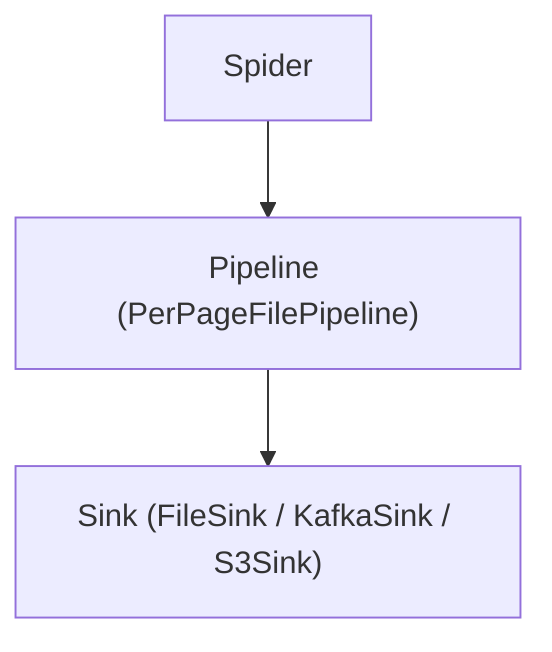

# scrapy_playwright_demo

Proyecto de ejemplo para scraping de sitios JavaScript-heavy usando Scrapy + Playwright, desplegable en Docker y Scrapyd.

## Configuration

**All configuration is centralized in [`scrapy_playwright_demo/config.py`](scrapy_playwright_demo/config.py) using the `AppSettings` class.**

- All Scrapy, Playwright, pipeline, proxy, and sink parameters are defined and documented in `AppSettings`.
- **Override any value** using environment variables or a `.env` file at the project root (see `.env.example`).
- Environment variable names match `AppSettings` attributes (e.g., `PAGE_SINK`, `ROTATING_UA_LIST`, etc.).
- [`settings.py`](scrapy_playwright_demo/settings.py) is now just an adapter that mirrors `app_settings` to Scrapy constants.

### Configuration Table

| Env Var / Setting           | Default                                      | Description |
|----------------------------|----------------------------------------------|-------------|
| BOT_NAME                   | scrapy_playwright_demo                       | Scrapy bot name |
| SPIDER_MODULES             | [scrapy_playwright_demo.spiders]             | List of spider modules |
| LOG_LEVEL                  | INFO                                         | Scrapy log level |
| JOBDIR                     | /data/state/zalando                          | Scrapy job state dir |
| PLAYWRIGHT_BROWSER_TYPE    | chromium                                     | Playwright browser (chromium, firefox, webkit) |
| PLAYWRIGHT_HEADLESS        | true                                         | Run browser headless |
| PLAYWRIGHT_DEFAULT_NAVIGATION_TIMEOUT_MS | 45000                        | Playwright navigation timeout (ms) |
| PLAYWRIGHT_MAX_CONTEXTS    | 2                                            | Max Playwright contexts |
| PLAYWRIGHT_MAX_PAGES_PER_CONTEXT | 4                                      | Max pages per context |
| AUTOPLAY_SCROLL_LOOPS      | 5                                            | Scroll loops for lazy loading |
| AUTOTHROTTLE_ENABLED       | true                                         | Enable Scrapy autothrottle |
| AUTOTHROTTLE_TARGET_CONCURRENCY | 2.0                                    | Target concurrency for autothrottle |
| RETRY_MAX_RETRIES          | 5                                            | Max retries for failed requests |
| RETRY_BACKOFF_BASE         | 1.5                                          | Exponential backoff base |
| RETRY_BACKOFF_CAP          | 60.0                                         | Max backoff (seconds) |
| RETRY_JITTER               | 0.3                                          | Jitter factor for backoff |
| RETRY_HTTP_CODES           | [429,500,502,503,504]                        | HTTP codes to retry |
| ROTATING_UA_LIST           | [see config.py]                              | List of User-Agents to rotate |
| PROXY_LIST                 | []                                           | List of proxies (optional) |
| PAGE_SINK                  | file                                         | Sink type: file, kafka, or s3 |
| PAGE_OUT_DIR               | /data/products                               | Output dir for file sink |
| PAGE_COMPRESS              | true                                         | Gzip output for file sink |
| PAGE_IDEMPOTENT            | true                                         | Skip writing if .done exists |
| PAGE_DROP_MISSING_FIELD    | true                                         | Drop items missing required fields |
| PAGE_KAFKA_TOPIC           | scrapy_pages                                 | Kafka topic for Kafka sink |
| PAGE_KAFKA_BOOTSTRAP       | localhost:9092                               | Kafka bootstrap servers |
| PAGE_S3_TEMPLATE           | s3://bucket/prefix/page-{page}.jl.gz         | S3 path template for S3 sink |
| SENTRY_DSN                 | (none)                                      | Sentry DSN for error reporting |
| PROMETHEUS_ENABLED         | false                                        | Enable Prometheus metrics |

## Switching sinks

To change where per-page data is written, set the following in your `.env` or environment:

**File sink (default):**
```
PAGE_SINK=file
PAGE_OUT_DIR=/data/products
```

**Kafka sink:**
```
PAGE_SINK=kafka
PAGE_KAFKA_TOPIC=my_topic
PAGE_KAFKA_BOOTSTRAP=localhost:9092
```

**S3 sink:**
```
PAGE_SINK=s3
PAGE_S3_TEMPLATE=s3://mybucket/prefix/page-{page}.jl.gz
```

## How to run the crawler

**Locally:**
```bash
pip install -r requirements.txt
playwright install chromium
scrapy crawl zalando -O zalando.json
```

**With Docker:**
```bash
docker-compose build
docker-compose up
```
Access Scrapyd at [http://localhost:6800](http://localhost:6800).

## How to run tests

**Locally:**
```bash
pytest -q
```

**With Docker (if you have a tester service):**
```bash
docker-compose run --rm tester
```

## Architecture



## Future work
- Async sinks for higher throughput
- Retry middleware improvements (e.g., per-exception policies)
- Plugin/extension system for custom sinks or extractors
- Integration tests with testcontainers/localstack for Kafka/S3

## Estructura
- `scrapy_playwright_demo/spiders/zalando.py`: Example Zalando spider.
- `scrapy_playwright_demo/config.py`: Centralized, typed config.
- `scrapy_playwright_demo/settings.py`: Scrapy config adapter.
- `scrapy_playwright_demo/sinks/`: Pluggable sink implementations.
- `Dockerfile`, `docker-compose.yml`: Production-ready infra.
- `.github/workflows/ci.yml`: CI for lint, type-check, and tests.

## Notas
- The spider waits for products to load using Playwright.
- You can extend the spider for pagination, more fields, etc. 